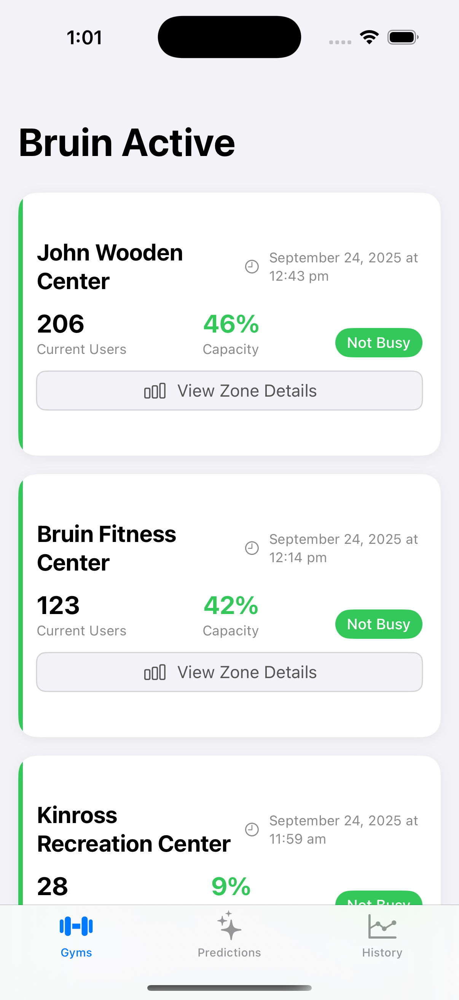
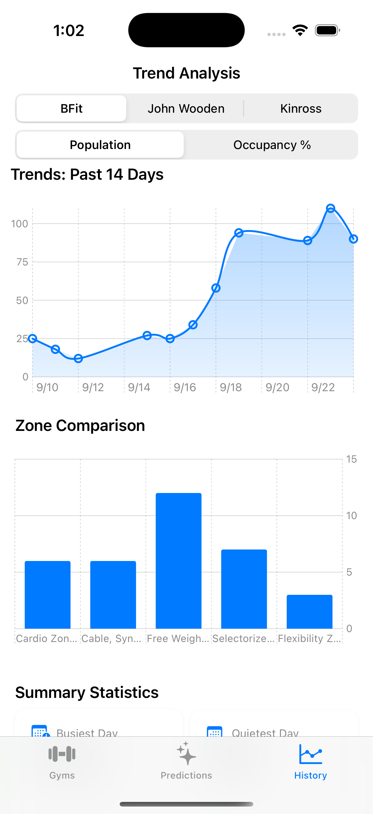
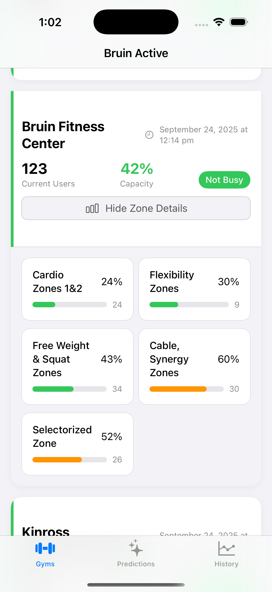

# BruinActiveMobile

## Solving the Problem

A persistent critique of UCLA Recreation is the busyness of the gyms. The main culprits–the John Wooden Center and BFit–are famously congested. As a solution, Bruin Active aims to adopt strategies that have been proven successful in other domains to assist the student body to avoid this traffic. 

A trend is identified by a few simple observations. On a macro-scale, Google was successful in making traffic more avoidable by giving information about traffic patterns to the consumer via Google Maps. Locally, apps such as Bruin Dining adopted a similar approach by providing the occupancy of the dining halls to help students avoid lines at UCLA's excellent dining facilities. The trend is giving information to the consumer. 

This has yet to be expanded into the fitness scene at UCLA. Ironically, this is a place where it’s demanded most. 

Bruin Active will achieve a solution by utilizing open-source data to provide more information about the occupation of the gyms. 

## Visualizations
#### Note: This data is currently being used to implement a prediction algorithm. Coming soon!

  

    
    
Parabolic Prediction

  

  

    
    
Sample Data

  

  

    
    
Weekend vs Weekday Averages

  

## Feature Screenshots
#### Note: As mentioned earlier, Predicitons UI is not yet complete.

  

    
  

  

    
  

  

    
  

